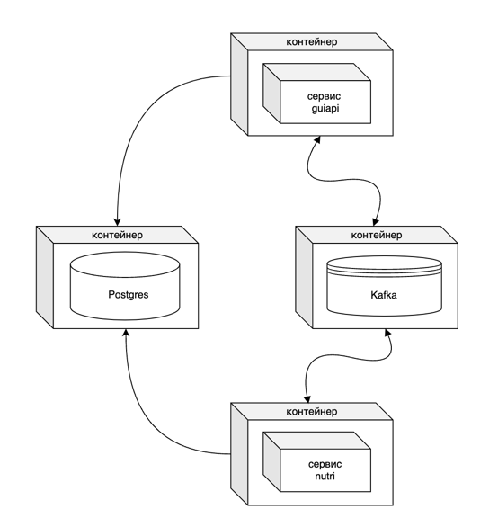

# recipegram

recipegram - социальная сеть для рецептов

Основной функционал:
    - авторизация
    - регистрация
    - добавление нового рецепта
    - редактирование рецепта
    - удаление рецепта
    - просмотр рецепта
    - просмотр ленты рецептов
    - расчет КБЖУ/микроэлементов
    - расширенный поиск по рецептам

Описание микросервисов:
1) guiapi - сервис для обработки поступающих http-запросов
2) nutri - сервис для расчета КБЖУ/микроэлементов блюд

Основные технолгии:
1) PostgresSQL
2) Kafka (брокер сообщений для взаимодействия между сервисами)
3) Docker-compose

Архитектура приложения:

